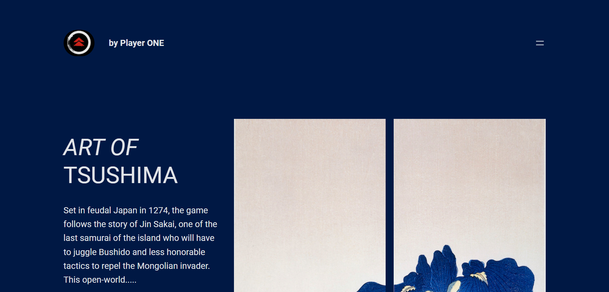
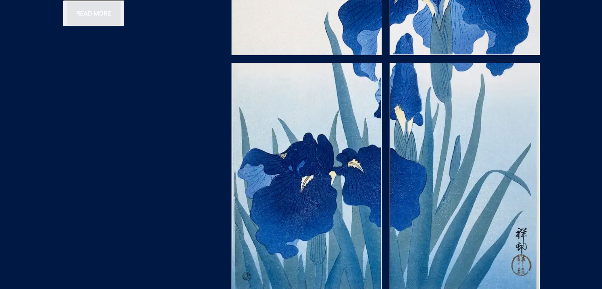

# Art of Tshushima





I have always loved the game Ghost of Tshushima, a Japanese-english game developed by Sucker Punch Production. So I decided to build something to remember it’s Weapons and Accessories.

## Usage

Clone it :

```
$ git clone https://github.com/Dibyaranjan450/Art-of-Tshushima.git
```

Visit the page at : 

```
https://dibyaranjan450.github.io/Art-of-Tshushima/
```

## Contributor

```
Creator of 'Art of Tshushima' @Dibyaranjan450
```
